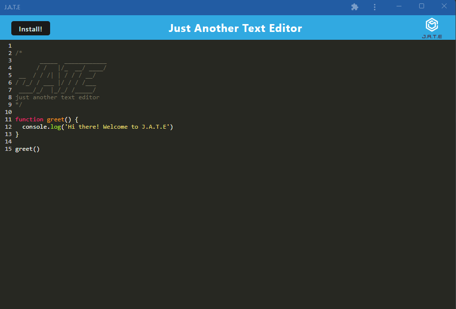

# Jate - Just Another Text Editor



## Description

J.A.T.E. is a progressive web app that lets users enters text into a text editor where the data persists even when offline.

Utilizes service workers and webpack plugins to be able to store the data to the browser's indexDb.

Users are also able to download the PWA to their local device and save it to their homepage.

## User Stories

- [x] User can input text into the text editor
- [x] User text data persists even when offline
- [x] User can download the progressive web app (PWA) from the browser and use like a native mobile or desktop app
- [x] User can save the PWA to their homepage

## Technologies Used

- [x] JavaScript
- [x] Webpack
- [x] Progressive Web App
- [x] HTML5
- [x] CSS3
- [x] Deployed to Heroku

## Usage

```
Enter text content into the text editor. Data is saved to IndexDb so data persists even when offline.
```

## Contributors

[Darius Garcia](https://github.com/dariusgarcia/)

## Installation

```
clone the repo to local machine
```

```
cd text-editor/
```

Install dependencies

```
npm install
```

Build script

```
npm run build
```

start webpack dev server

```
npm run start:dev
```
